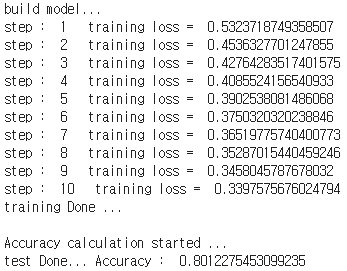

# Movie-Review

## **bi_LSTM과 Self_attention을 이용한 영화 리뷰 극성파악 (긍/부정 파악)**

## **실행 방법**
1. model_train.py 실행
	- ratings_train.txt 파일을 통해 단어 임베딩 lookup table 생성
    - lookup table를 사용하여, 각 리뷰를 벡터들로 표현
    - bi_LSTM을 적용 후, self_attention 적용
    - feed forward neural network를 거쳐
    - softmax 함수를 통해 긍정, 부정 예상
    - loss를 계산해 AdamOptimizer로 트레이닝
    - 트레이닝 종료 후 tf.train.Saver()를 통해 checkpoint 생성
    
2. model_test.py 실행
	- 미리 저장된 checkpoint의 meta graph를 복원
    - tensor name을 기준으로 필요한 tensors 추출
    - 사용자로부터 입력을 받음
    - 입력문을 lookup table을 통해 벡터로 표현, zero_padding
    - 모델을 이용하여 사용자의 입력문을 긍정 혹은 부정으로 판단
    
**실행 화면**
- Training

정확도는 80%로, 기존의 MSWon 님의 정확도인 86%보다 낮다.
본 모델은 다음과 같은 특징이 있기 때문에 정확도가 낮아졌을 거라고 판단됨.
1. 형태소 분석을 사용하지 않고 토크나이징만 사용.
2. training data로부터 워드임베딩을 만들지 않고 pre-trained 된 것을 사용해 영화리뷰라는 특정 분야에만 적합한 .

- Test

p.s 사용하는 노트북 상에서 메모리가 부족하여 google colab에서 작업하였습니다.

## **데이터**

bi_LSTM을 이용한 영화 리뷰 극성파악은 아래를 참고하였습니다.
(https://github.com/MSWon/Sentimental-Analysis)

영화 리뷰 자료
(https://github.com/e9t/nsmc)

bi_LSTM과 Self_attention을 연결한 구조는 아래를 참고하였습니다.
(https://github.com/SenticNet/context2vec)

기본 워드 임베딩은 pre trained FastText를 사용하였습니다.
(https://github.com/chakki-works/chakin)
